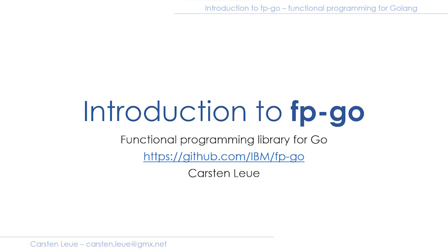

# Samples

This folder is meant to contain examples that illustrate how to use the library. I recommend the following reading to get an idea of the underlying concepts. These articles talk about [fp-ts](https://github.com/gcanti/fp-ts) but the concepts are very similar, only syntax differs.

# Video Introduction

### References

- [Ryan's Blog](https://rlee.dev/practical-guide-to-fp-ts-part-1) - practical introduction into FP concepts
- [Investigate Functional Programming Concepts in Go](https://betterprogramming.pub/investigate-functional-programming-concepts-in-go-1dada09bc913) - discussion around FP concepts in golang
- [Investigating the I/O Monad in Go](https://medium.com/better-programming/investigating-the-i-o-monad-in-go-3c0fabbb4b3d) - a closer look at I/O monads in golang
- 