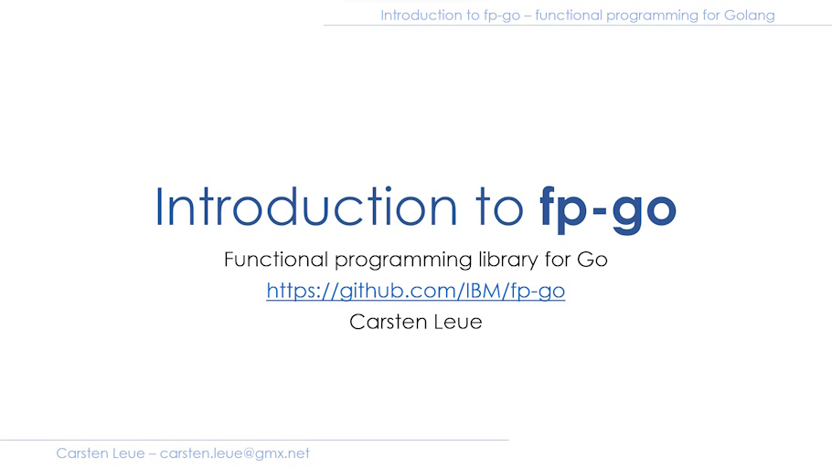

# Samples

This folder is meant to contain examples that illustrate how to use the library. I recommend the following reading to get an idea of the underlying concepts. These articles talk about [fp-ts](https://github.com/gcanti/fp-ts) but the concepts are very similar, only syntax differs.

# Video Introduction

## External Documentation References

### Official Documentation

- [API Documentation](https://pkg.go.dev/github.com/IBM/fp-go/v2) - Complete API reference
- [Go 1.24 Release Notes](https://tip.golang.org/doc/go1.24) - Information about generic type aliases
- [Go Blog: Generating code](https://go.dev/blog/generate) - Using `go generate`
- [Go Context Package](https://pkg.go.dev/context) - Standard library context documentation

### Functional Programming Concepts

#### Introductory Resources
- [Ryan's Blog](https://rlee.dev/practical-guide-to-fp-ts-part-1) - Practical introduction into FP concepts
- [Investigate Functional Programming Concepts in Go](https://betterprogramming.pub/investigate-functional-programming-concepts-in-go-1dada09bc913) - Discussion around FP concepts in golang
- [Investigating the I/O Monad in Go](https://medium.com/better-programming/investigating-the-i-o-monad-in-go-3c0fabbb4b3d) - A closer look at I/O monads in golang
- [Professor Frisby's Mostly Adequate Guide](https://github.com/MostlyAdequate/mostly-adequate-guide) - Comprehensive FP guide
- [mostly-adequate-fp-ts](https://github.com/ChuckJonas/mostly-adequate-fp-ts/) - TypeScript companion to Frisby's guide

#### Currying and Function Composition
- [Mostly Adequate Guide - Ch. 4: Currying](https://mostly-adequate.gitbook.io/mostly-adequate-guide/ch04) - Excellent introduction with clear examples
- [Curry and Function Composition](https://medium.com/javascript-scene/curry-and-function-composition-2c208d774983) by Eric Elliott
- [Why Curry Helps](https://hughfdjackson.com/javascript/why-curry-helps/) - Practical benefits of currying

### Haskell and Type Theory

- [Haskell Wiki - Currying](https://wiki.haskell.org/Currying) - Comprehensive explanation of currying in Haskell
- [Learn You a Haskell - Higher Order Functions](http://learnyouahaskell.com/higher-order-functions) - Introduction to currying and partial application
- [Haskell's Prelude](https://hackage.haskell.org/package/base/docs/Prelude.html) - Standard library showing data-last convention
- [Haskell Pair Type](https://hackage.haskell.org/package/TypeCompose-0.9.14/docs/Data-Pair.html) - Haskell definition of Pair
- [Haskell Lens Library](https://hackage.haskell.org/package/lens) - Pioneering optics library

### Optics

- [Introduction to optics: lenses and prisms](https://medium.com/@gcanti/introduction-to-optics-lenses-and-prisms-3230e73bfcfe) by Giulio Canti - Excellent introduction to optics concepts
- [Lenses in Functional Programming](https://www.schoolofhaskell.com/school/to-infinity-and-beyond/pick-of-the-week/a-little-lens-starter-tutorial) - Tutorial on lens fundamentals
- [Profunctor Optics: The Categorical View](https://bartoszmilewski.com/2017/07/07/profunctor-optics-the-categorical-view/) by Bartosz Milewski - Deep dive into the theory
- [Why Optics?](https://www.tweag.io/blog/2022-01-06-optics-vs-lenses/) - Discussion of benefits and use cases

### Related Libraries

- [fp-ts](https://github.com/gcanti/fp-ts) - TypeScript library that inspired fp-go
- [fp-ts Documentation](https://gcanti.github.io/fp-ts/) - TypeScript library documentation
- [fp-ts Issue #1238](https://github.com/gcanti/fp-ts/issues/1238) - Real-world examples of data-last refactoring
- [urfave/cli/v3](https://github.com/urfave/cli) - Underlying CLI framework

### Project Resources

- [GitHub Repository](https://github.com/IBM/fp-go) - Source code and issues
- [Coverage Status](https://coveralls.io/github/IBM/fp-go?branch=main) - Test coverage reports
- [Go Report Card](https://goreportcard.com/report/github.com/IBM/fp-go/v2) - Code quality metrics
- [Apache License 2.0](https://github.com/IBM/fp-go/blob/main/LICENSE) - Project license

### Internal Documentation

- [DESIGN.md](../DESIGN.md) - Design philosophy and patterns
- [IDIOMATIC_COMPARISON.md](../IDIOMATIC_COMPARISON.md) - Performance comparison between standard and idiomatic packages
- [Optics Overview](../optics/README.md) - Complete guide to lenses, prisms, and other optics
- [CLI Package](../cli/README.md) - Command-line interface utilities
- [ReaderResult Package](../idiomatic/context/readerresult/README.md) - Context-aware result handling